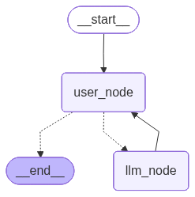

# RAG Agent

A simple local RAG project built with **Ollama**, **LangChain**, and **ChromaDB**.  
It lets you ask questions about a PDF using a fully local LLM setup, with embeddings stored on disk so you don’t have to re-index every time.

## Stack

- Ollama for local models 
- LangChain for loading, splitting, retrieval, and QA 
- ChromaDB for persistent vector storage
- LangGraph for agent workflow
> 

## Setup

```bash
git clone https://github.com/arjunvprakash/rag-agent.git
cd rag-agent

python3 -m venv .venv
source .venv/bin/activate

pip install -r requirements.txt
```

Install and run Ollama, then pull the models you want to use. Local RAG examples commonly use one embedding model and one chat model.

```bash
ollama serve
ollama pull mxbai-embed-large
ollama pull llama3.2:3b
```

## Usage

1. Put your PDF inside the `data/` folder.
2. Run the script:

```bash
python3 src/rag.py
```

## Project structure

```
.
├── agent.png       # Mermaid representation of the LangGraph workflow
├── chroma_db       # Dir for vectorstore persistence
├── data            # RAG source directory
│   └── data.pdf    # Document for RAG
├── LICENSE
├── README.md
├── requirements.txt
└── src
    ├── agent.py    # LangGraph workflow
    └── rag.py      # RAG code
```

## Basic Tests

> [!WARNING]
>  Relevant only for a specific PDF document that used for the test scenario.

|Questions|
|---|
|  how are you? |
|  what is the document? |
| who is the author of this document? |
| how many pages |
|  Give a one line summary of the document |
|  Who is the reviewer |
|  which university |
|  what course was this report submitted for |
|  What is the name of the proposed solution |
|  summarize the document |
